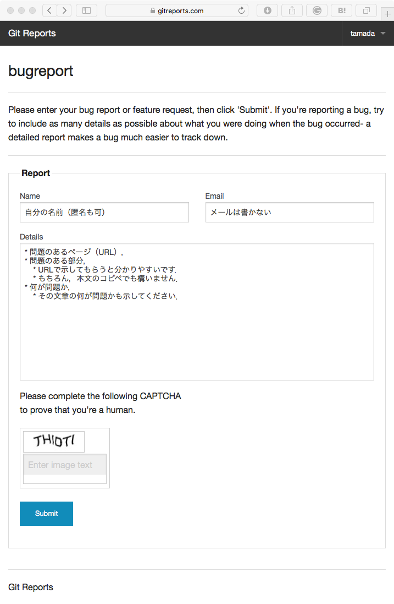
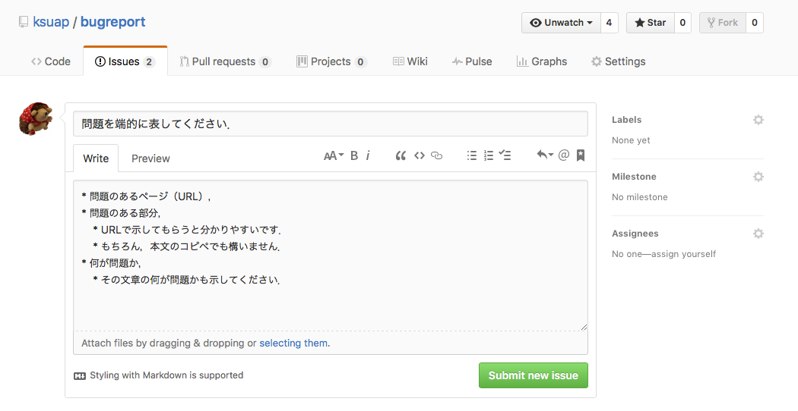

# バグ報告

## プロジェクトの概要

このプロジェクトは，講義資料のバグ報告を行うためのプロジェクトです．
報告されたバグは，[Issues](https://github.com/ksuap/bugreport/issues) から確認できます．
バグ報告も [Issues](https://github.com/ksuap/bugreport/issues) の「New issue」ボタンをクリックすることで行えますが，
GitHub へのユーザ登録が必要になります．

GitHub のアカウントをお持ちの方は，ログインしてご報告をお願いします．
GitHub のアカウントをお持ちでなく，持っていても匿名で報告したい，という方は，以下のURLにアクセスしてください．

    https://gitreports.com/issue/tamada/bugreport

ここからバグ報告を行えば，匿名で投稿できます．このページから投稿したサンプルは，
[ここから参照できます](https://github.com/ksuap/bugreport/issues/1)．

## バグ報告の方法

### GitHub のアカウントを持っていない場合（匿名で報告する場合）

1. [GitReports](https://gitreports.com/issue/tamada/bugreport)のページへ行き，バグ報告を行ってください．
3. Nameはできれば書いてください．匿名でも構いません．
4. Emailは書かないでください．投稿されたIssueにここに書いた内容が記載されるため，スパムが届くようになる可能性が高いです．
2. 次の内容をDetail欄に記入してください．
    * 問題のあるページ（URL），
    * 問題のある部分，
        * URLで示してもらうと分かりやすいです．
        * もちろん，本文のコピペでも構いません．
    * 何が問題か，
        * その文章の何が問題かも示してください．
5. CAPTCHAのアルファベットを記入してください．
スパムボットの自動投稿を避けるためのものです．
6. 「Submit」ボタンを押せば投稿完了です．

### GitHub のアカウントから報告する場合

1. [Issue](https://github.com/ksuap/bugreport/issues)のページへ行き，
右上にある「New Issue」のボタンを押してください．
2. Issueのタイトルを記入してください．
    * タイトルは問題を端的に表してください．
3. 本文に問題があった内容について記載してください．
    * 問題のあるページ（URL），
    * 問題のある部分，
        * URLで示してもらうと分かりやすいです．
        * もちろん，本文のコピペでも構いません．
    * 何が問題か，
        * その文章の何が問題かも示してください．
4. 最後に問題を確認した後，「Submit new issue」ボタンを押してください．
投稿が完了します．

